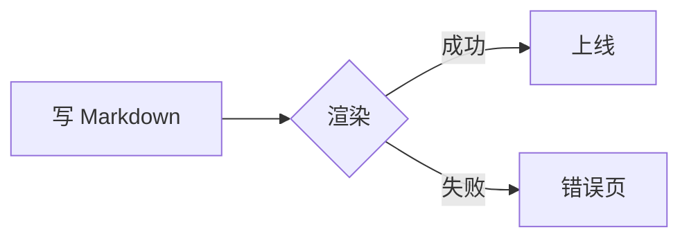
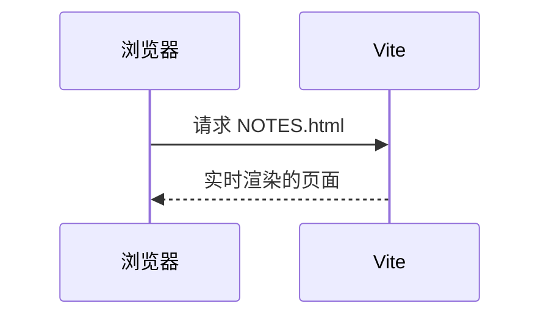

# 演示笔记：Markdown 全写法

这一页覆盖 Markdown 页面支持的所有写法。源文件是 `topics/test-cases/site-demo/NOTES.md`，对照着看最直观。

中文段落在源文件里
换了行，渲染后不应该在「里」和「换」之间多出空格。English words across a
line break keep their space.

## 行内格式

**粗体**、*斜体*、***粗斜体***、~~删除线~~、==高亮==、++插入++、`行内代码`、H~2~O、x^2^、<kbd>⌘</kbd> + <kbd>K</kbd>。

自动链接：https://example.com 。外部链接 [markdown-it](https://markdown-it.github.io/) 会在新标签页打开。emoji：:tada: :rocket: :white_check_mark:。

缩写：鼠标悬停在 HTML 和 CSS 上会显示全称。

*[HTML]: HyperText Markup Language
*[CSS]: Cascading Style Sheets

## 链接

- 相对 `.md` 链接自动改成 `.html`：[术语表](GLOSSARY.md)、[第二条学习记录](learning-records/0002-markdown-published.md)
- 指向 MISSION 的链接落到主题首页：[学习目标](MISSION.md)
- 链接到 HTML 课程和参考：[第 1 课](lessons/0001-typography.html)、[验证清单](reference/checklist.html)
- wiki 链接，按文件名：[[GLOSSARY.md]]、[[0001-baseline]]；按标题：[[验证清单]]；带显示文字：[[RESOURCES|资料列表]]；带小节：[[GLOSSARY#terms]]
- 找不到的 wiki 链接显示成灰色虚线：[[不存在的页面]]
- 页内锚点：[跳到「公式」](#公式)

## 标题层级

### 三级标题

#### 四级标题

四级标题不进入本页目录，但有锚点。

### 带属性的标题 {.muted}

用 `{.muted}` 给标题加了类。

## 列表

- 无序列表
  - 嵌套一层
    - 嵌套两层
- 第二项

1. 有序列表
2. 第二项
   1. 嵌套有序
   2. 嵌套有序

任务列表：

- [x] 已完成的任务
- [ ] 未完成的任务
- [ ] 带 **格式** 的任务

定义列表：

正文栏
: 正文文字所在那一栏。

旁注
: 浮在正文右侧的补充说明。
: 一个术语可以有多条解释。

## 引用与分隔线

> 普通引用块。
>
> > 嵌套引用。

---

## 提示框

GitHub 写法，五种类型：

> [!NOTE]
> 说明：补充信息。

> [!TIP]
> 技巧：更好的做法。

> [!IMPORTANT]
> 重要：必须知道的事。

> [!WARNING]
> 注意：容易踩的坑。

> [!CAUTION] 自定义标题也可以
> 警告：后果严重的操作。

`:::` 写法，和课程里的 `.callout` 一一对应：

::: note
note 说明。
:::

::: tip 自定义标题
tip 技巧，支持 **格式** 和 `代码`。
:::

::: important
important 重要。
:::

::: warning
warning 注意。
:::

::: caution
caution 警告。
:::

::: source 推荐资料
source：这一课的主资料是 [markdown-it 文档](https://markdown-it.github.io/)。
:::

::: ask
ask：有不明白的地方，随时问老师（agent）。
:::

::: details 点开看答案
折叠内容。里面也可以放列表：

- 第一条
- 第二条
:::

## 代码

```rust
// Rust：所有权转移
fn main() {
    let s = String::from("hello");
    let t = s; // s 在这里失效
    println!("{t}");
}
```

```ts
interface Page { url: string; title: string }
const pages: Page[] = [{ url: "a.html", title: "第一页" }];
```

```bash
make serve   # 开发服务器
make build   # 静态构建
```

```diff
- 旧的一行
+ 新的一行
```

```json
{ "name": "learning", "private": true }
```

不认识的语言按纯文本输出：

```not-a-real-language
这里没有高亮，但不应该报错。
```

没写语言：

```
plain text block
```

一行很长的代码应该出现横向滚动条而不是撑破页面：

```js
const veryLongLine = ["一", "二", "三", "四", "五", "六", "七", "八", "九", "十", "十一", "十二", "十三", "十四", "十五", "十六", "十七", "十八"].map((x, i) => `${i}:${x}`).join(", ");
```

## 公式

行内公式 $E = mc^2$，以及 $\sum_{i=1}^{n} i = \frac{n(n+1)}{2}$。

块级公式：

$$
\int_0^1 x^2\,dx = \frac{1}{3}
$$

$$
\begin{aligned}
f(x) &= (x+1)^2 \\
     &= x^2 + 2x + 1
\end{aligned}
$$

写错的公式不应该让整页报错：$\frac{1}{$。

## 图表





切换配色后，图表应该跟着换主题。

## 表格

| 写法 | 效果 | 数值 |
| :--- | :---: | ---: |
| 左对齐 | 居中 | 1 |
| `代码` | **粗体** | 22 |
| [链接](GLOSSARY.md) | ==高亮== | 333 |
| 第四行 | 斑马纹 | 4444 |

很宽的表格应该在自己的区域里横向滚动：

| 列一 | 列二 | 列三 | 列四 | 列五 | 列六 | 列七 | 列八 | 列九 | 列十 |
| --- | --- | --- | --- | --- | --- | --- | --- | --- | --- |
| 很长很长的单元格内容 | 很长很长的单元格内容 | 很长很长的单元格内容 | 很长很长的单元格内容 | 很长很长的单元格内容 | 很长很长的单元格内容 | 很长很长的单元格内容 | 很长很长的单元格内容 | 很长很长的单元格内容 | 很长很长的单元格内容 |

## 图片


## 内嵌 HTML

Markdown 里可以直接写 HTML，也可以用全站组件：

<div class="callout callout--source"><span class="callout__title">直接写的 .callout</span><p>和课程里一模一样。</p></div>

<details><summary>原生 details</summary>

里面继续写 **Markdown**。

</details>

## 嵌套与重复

同名标题的锚点要能去重：下面两个「重复标题」在本页目录里各自跳到自己的位置。

### 重复标题

第一个。

### 重复标题

第二个。

列表里的代码块和公式：

1. 第一步，运行：

   ```bash
   pnpm install
   ```

2. 第二步，公式也能缩进在列表里：

   $$
   a^2 + b^2 = c^2
   $$

提示框里的代码、公式和表格：

> [!TIP]
> 行内公式 $O(n \log n)$，代码块：
>
> ```python
> sorted(items, key=len)
> ```
>
> | 复杂度 | 例子 |
> | --- | --- |
> | $O(1)$ | 哈希查找 |
> | $O(n)$ | 线性扫描 |

::: warning 容器里的列表
- 第一条
- 第二条，带 `代码`
:::

一个特别特别长的标题，用来检查本页目录里长标题会不会换行、会不会把右侧目录撑宽
---------------------------------------------------------------------

（上面是 Setext 写法的二级标题。）

## 脚注

正文里引用脚注[^first]，再引用一个[^second]，同一个脚注可以引用两次[^first]。

[^first]: 第一个脚注。
[^second]: 第二个脚注，可以包含 `代码` 和 [链接](https://example.com)。
